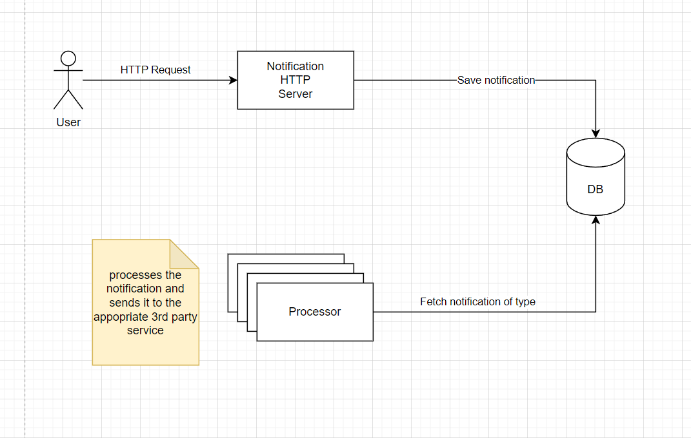
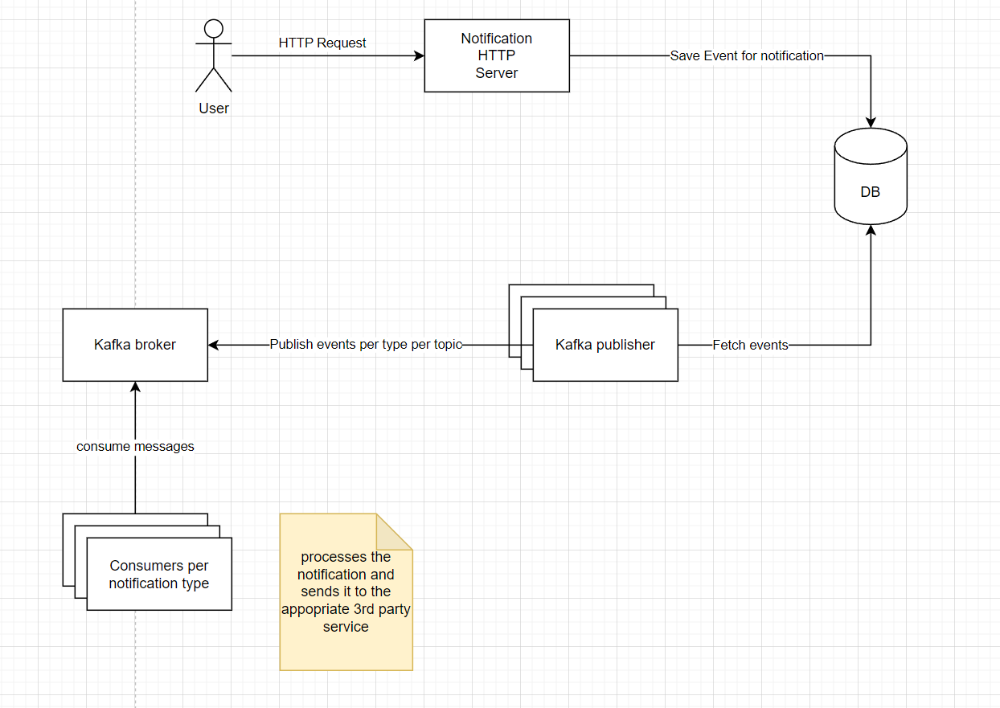

# Notification system

## Architecture

The idea behind how to system operates is that it separates the accepting of new notification from the actual sending of them.

Each notification has a type with which it is inserted in the database.
Processor is started for each type of notification and can be scaled as needed (limited by the database queueing possibilities).

### Using only Postgres with processors



With this approach we can use postgres as a queue and process the records in the database with processor which can be scaled independently.
The solution will have the benefit of the automatic retry in case of failure of an event to be processed. Only if the event was succesfully processed it will be removed from the database in a single transaction.


A drawback to this approach is that Postgres might become a bottleneck in case of pailing up too many notifications in the database, because processors will become slower and slower in selecting the notifications to process because they will fight each other to find notifications.

The "at least once" guarantee is satisfied by the fact that the processor will surely delete the event only in case it was send to the 3rd party service and processed.
However there is the possibility for duplicates in case of one event was processed by the 3rd party system, but the transaction has failed. This can be improved if the 3rd party system supports idempotent operations.

The system does not guarantee order of which the notifications will arrive, so it is possible to have a notification that is inserted after another, but it might be delivered earlier. Depends on the 3rd party system response time.
This can be fixed by adding a key to partition dependent notifications and they can be processed sequentially.


#### Improvements

* The solution can be armed with retry mechanism when trying to process notification after it was selected from the database in order to skip select requests in case of failures.
* Batch size can be tweaked further to make the system run better.
* Each process can be further parallelised with go routines to fully utilize the process.
* Logging, monitoring and metrics should be added to better visualize the system behaviour.
* Tests are missing at this point and should be added.
* Endpoint to check status of the notifications can also be added and processed notifications can be saved in a different table in the database.

### Using Kafka



Another approach that should give better results is using kafka with the outbox pattern.

* The HTTP REST API saves notifications in the form of events in the Postgres database.
* Kafka publisher (that can be scaled) looks for events from the database and publishes them to the Kafka broker.
* Kafka Consumers will listen for the topics (one per each notification type) and will send the notifications to the 3rd party services.
* This approach also guarantees "at least once" delivery with the possibility for duplicates.

## API

### HTTP POST `/email`

**Request**

```json
{
    "message":"Hello World",
    "recepient":"<email>"
}
```

**Response**

*Status: OK*
```json
OK
```

### HTTP POST `/sms`

**Request**

```json
{
    "message":"Hello World",
    "recepient":"<phone_number>"
}
```

**Response**

*Status: OK*
```json
OK
```


### HTTP POST `/slack`

**Request**

The recepient depends on the Webhook that is configured

```json
{
    "message":"Hello World",
}
```

**Response**

*Status: OK*
```json
OK
```


## Running in production

### Kubernetes

* The server can be deployed on a kubernetes cluster together with the processors as a Deployments.
* They can be scaled based on CPU/Memory and number of notifications that are piled up in order to handle the load.

**Note:** In case Kafka is used there are hosted solutions that provide Kafka clusters.

### Serverless, Kubernetes and Pubsub

* Server will run on kubernetes as a deployment and write to Pubsub.
* Cloud functions can be used to process the notifications and scale them based on Pubsub notifications automatically.